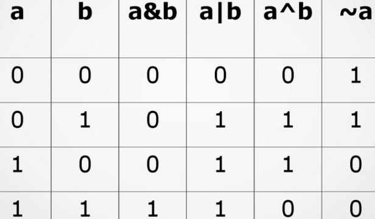

# Bit Manipulation

Must know:

* Logical Operations 
* Bit Rotation
* Bit Shifting
* Bit Clearing

For embedded software engineers, it's the most important topic for interviews.

Bitwise operations, bitlogic algorithms, and bit manipulation are topics that you need to master if you want to work
in graphics or low-level development - learn about endianness.

## Bitwise Operators in C and C++

- **& (AND)**: takes two numbers as operands and does AND on every bit of the two numbers. True if both bits are true.
- **| (OR)**: takes two numbers as operands and does OR on every bit of the two numbers. True if any of the two bits 
is true.
- **^ (XOR)**: takes two numbers as operands and does XOR on every bit of the two numbers. True if the two bits are
different.
- **<< (left shift)**: takes two numbers, left shifts the bits of the first operand, and the second operand decides the
number of places to shift.
- **>> (right shift)**: takes two numbers, right shifts the bits of the first operand, and the second operand decides the
number of places to shift.
- **~ (NOT)**: takes one number and inverts all bits of it.



## Bitwise Operators Hacks

1. Right shift (>>) operator is equivalent to division by 2
2. Left shift (<<) operator is equivalent to multiplication by 2
3. Use bitwise AND (&) operator to check even or odd number
4. Store multiple flags in a single variable - use bit masking to store multiple flag values in a single variable
5. Quickly find 1s and 2s complement of a number - 1 complement (~), get 2 complement by adding 1 to 1 complement
6. Conditional assignment using XOR (^)
7. Find maximum or minimum without if...else
8. Swap to numbers without the third variable using XOR(^)

More bit twiddling hacks [here](https://graphics.stanford.edu/~seander/bithacks.html).

## Classic Bit Manipulation Problems

- **Hamming Weight**

Write a function that takes an unsigned integer and returns the number of '1' 
bits it has.

First approach - [Iterate over each bit](https://github.com/alanrubik/Challenges/blob/main/rob/191.c)

A better approach - [Brian Kernighan's Algorithm](https://github.com/alanrubik/Challenges/blob/main/rob/191_kernighan.c)

```
1. Initialize count = 0
2. If integer n is not zero
     - Do bitwise & with (n-1) and assign the value back to n
       n = n & (n-1)
     - Increment count by 1
     - Go to step 2
3. Else return count
```

- **Reverse Bits**

## Bit Numbering (MSB vs LSB and Little Endian vs Big Endian)

"The order in which the bytes are stored in data memory"

MSB - Most Significant Bit (the bit in a multiple-bit binary number with the largest value)

LSB - Least Significant Bit (the bit in a multiple-bit binary number with the smallest value)

Big-endian:

MSB is stored in the first data memory address (lowest memory address), and LSB is stored in the last data memory address (highest memory address).

Little-endian:

LSB is in the first memory address, and MSB is in the last.
