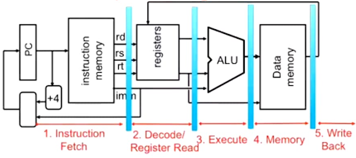

# Computer Architecture

## Central Processing Unit

## Memory

## Processor Registers

## Program Counter

## Complex Instruction Set Computers (CISC)

* x86

## Reduced Instruction Set Computers (RISC)

* ARM
* RISC-V

## Pipelining

**Pipeline registers.**

You need **registers between stages** to hold information produced in the previous cycles.

## Pipeline Hazards

## Very Long Instruction Word (VLIW)

## Superscalar Processor

## Program Status Register

## Big Endian vs Little Endian

Most architectures nowadays use little-endian. Except for AVR that uses big-endian.

One advantage of little-endian is that in small 8-bit processors you can start processing data as soon as you load the first byte.
