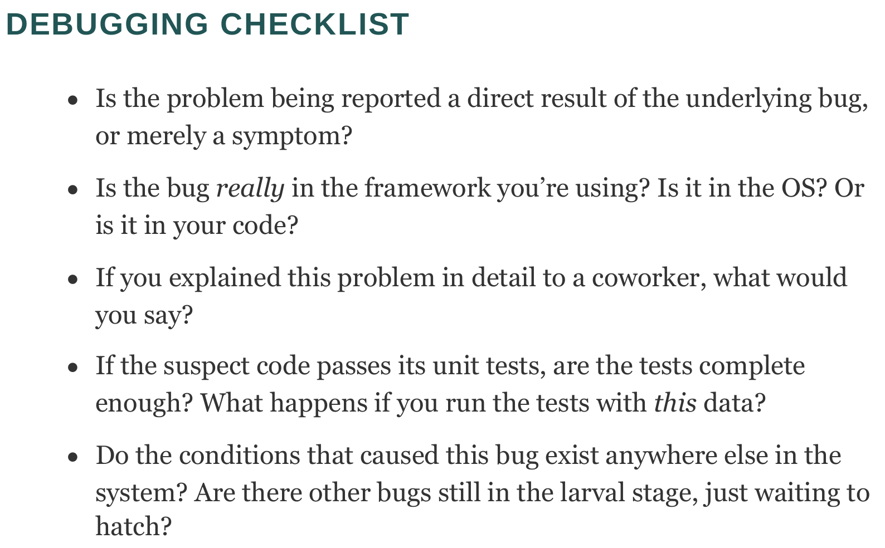

# Debugging

Debugging is an art, and not a science. There is no step-by-step procedure or a single recipe for success when debugging a problem. Asking the following questions can help to understand and identify the nature of the problem and how best to solve it [1]:

* Is the problem easily reproducible?

* Is there a reproducer or test that can trigger the bug consistently?

* Are there any panic, or error, or debug messages in the dmesg when the bug is triggered?

* Is reproducing the problem time-sensitive?

When developing software in an embedded environment, the most likely scenario when testing a new hardware interface is...
nothing happens. Unless things work perfectly, it is difficult to know where to begin looking for problems. With a logic
analyzer, one can capture and visualize any data that is being transmitted.

For example, when working on software to drive a serial port, it is possible to determine whether anything is being transmitted,
and if so, what. This becomes especially important where the embedded processor is communicating with an external device - where
every command requires a transmitting and receiving a specific binary sequence. A logic analyzer provides the key to observing the
actual communication events (if any!).

One of the most useful techniques for debugging software is to print messages to a terminal.

Serial communication through USART (Universal Synchronous Asynchronous Receiver Transmitter), in order to access
a terminal on the board.

Asynchronous serial - debugging

## How to approach debugging?

1. Make sure that you are working on code that built cleanly—without warnings

2. You need to gather all the relevant data - in some cases you may actually need to watch the user who reported the bug in action to get a sufficient level of detail

3. The best way to start fixing a bug is to make it reproducible. After all, if you can’t reproduce it, how will you know if it is ever fixed?
Failing Test Before Fixing Code - be able to reproduce the case with one command

4. Read the Damn Error Message
    * Bad Results - What if it’s not a crash? What if it’s just a bad result? Understand the definition of fault, error, failure (from ECE 716)

5. Use a debugger - make sure that you’re also seeing the incorrect value in the debugger.
    * Make sure you know how to move up and down the call stack and examine the local stack environment.
    * Keep notes of your process

6. Sensitivity to Input Values - get a copy of the data that makes your program fail, and make sure that it fails in your environment as well

7. Regressions Across Releases - look back into your release git history and see what release was the last one that worked fine and see what changes were introduced right before the bug

8. Use binary chop (binary search) - with the stacktrace errors log, the releases between the current one and the last working, and with input data

9. Loggin and/or tracing
    * Debuggers generally focus on the state of the program now. Sometimes you need more—you need to watch the state of a program or a data structure over time.
    * Tracing statements are those little diagnostic messages you print to the screen or to a file that say things such as “got here” and “value of x = 2.”

10. Rubber Ducking - A very simple but particularly useful technique for finding the cause of a problem is simply to explain it to someone else.

11. Don’t Assume It—Prove It 
Don’t gloss over a routine or piece of code involved in the bug because you “know” it works. Prove it. Prove it in this context, with this data, with these boundary conditions. - basically what you learned at ECE 653

## Systematic debugging:

* Debugging
* Tracing: is a specialized use of logging to record information about a program’s execution.
* Profiling: is the process of measuring an application or system by running an analysis tool called a profiler. Profiling tools can focus on many aspects: function call times and count, memory usage, cpu load, and resource usage.

## Debugging Tools and Techniques

### Software

- Tracing - print statements to the terminal, logs
- GDB
- Kernel - KGDB
- Stack trace analysis (kernel - scripts/decode_stacktrace.sh)

### Hardware

- Oscilloscope
- Logic Analyzer

## Debugging Checklist

## Frequently Asked Questions

How do you approach debugging?
System debugging

## References

[1] LFD103 - Linux Foundation
