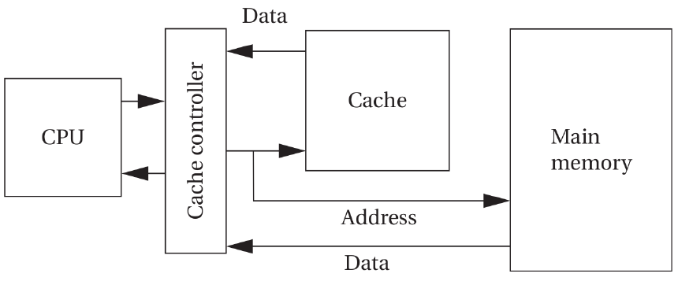
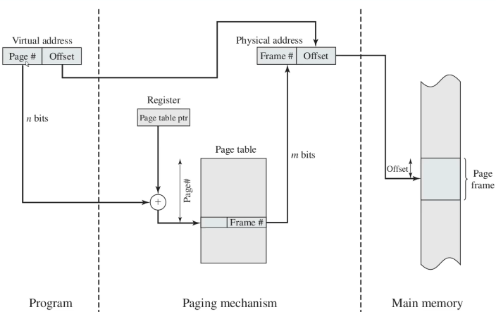
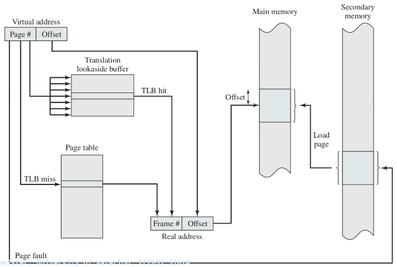
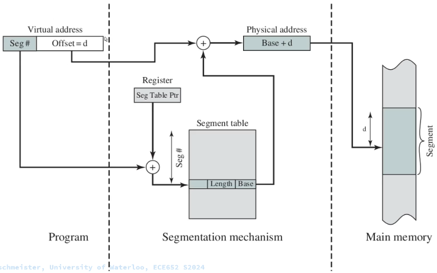
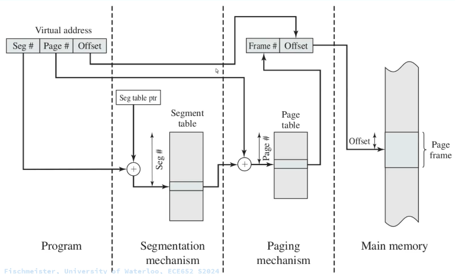
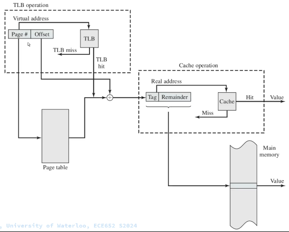

# Memory

This page discusses memory, memory hierarchy, caching, and virtual memory in modern embedded systems.

## Cache

The cache is the fastest and most expensive memory that you can have in your computer system. The cache memory is inside the processor.

The cache is a very limited amount of memory in your system. Hence, you need to have a main memory.

The cache is a small and fast memory that keeps the working set of a program close to the computation.

Processors might have multiple levels of caches before finding data in the main memory.

### Cache Concepts

* **Cache Hit:** A cache hit occurs when the CPU requests data and that data is already present in the cache.

Result: Fast access (no need to go to main memory).

* **Cache Miss:** A cache miss occurs when the requested data is not in the cache, so it must be fetched from a lower memory level (L2/L3/RAM).

Result: Slower access due to memory latency.

### Types of Cache Misses

* **Cold Miss (Compulsory Miss):** A cold miss happens the first time a piece of data is accessed.

The cache has never seen this data before.

Unavoidable. Even a perfect cache will experience cold misses.

* **Capacity Miss:** A capacity miss occurs when the cache cannot hold all the data needed by the program.

Even if the cache were fully associative, it still wouldn’t fit everything.

Caused by cache being too small.

* **Conflict Miss:** It happens when two different memory addresses map to the same cache set.

A conflict miss occurs in set-associative or direct-mapped caches when multiple memory blocks map to the same cache set and evict each other repeatedly.

Example: If cache index uses bits [8:6], and two addresses differ only in higher bits but share the same index bits → they collide.

Also called a collision miss.

* **Hit Rate**

Hit Rate = (Number of Cache Hits) / (Total Memory Accesses)

Example: If 95 out of 100 accesses are hits → Hit Rate = 95%

* **Miss Rate**

Miss Rate = 1 − Hit Rate

or

Miss Rate = (Number of Misses) / (Total Memory Accesses)

If Hit Rate = 95%
Miss Rate = 5%

### Write Policies

* **Write Through**

On a write:

* Update cache
* Immediately update main memory

✔️ Simpler consistency
❌ Slower writes
❌ Higher memory bandwidth usage

Often paired with write buffer.

* **Write Back**

On a write:

* Update cache only
* Mark cache line as dirty
* Write to memory only when the line is evicted

✔️ Faster writes
✔️ Lower memory bandwidth
❌ More complex (needs dirty bit)

## Memory Hierarchy

The memory hierarchy says that the faster the memory is, the lower its capacity and the more expensive it is. The cheaper memory is thus slower, and we can get a bigger capacity.

Accessing memory in the main memory is slower than accessing data in the cache.

## Virtual Memory and Memory Address Translation

Virtual memory is enabled by memory address translation.

Memory address translation provides a layer of indirection to enable additional functionality where the address a program tries to access is not the same as the physical address in memory where this data is located.

When a program tries to access an address a particular address, that doesn't mean that it will find it at that specific address; instead, thanks to virtual memory, there's a layer of indirection between these two addresses.

Uses of virtual memory:

* Multitasking
* Memory protection
* Data security
* Larger address space

Microcontrollers used in embedded systems usually don't include an MMU. Thus, virtual memory is not immediately accessible to embedded systems programmers. In ARM microcontrollers, you can use the MPU to mark memory regions as code or data to add an extra layer of memory protection.

Virtual memory concepts:

* **Paging**

The process sees a virtual address in a system that uses memory paging.

In computer operating systems, memory paging (or **swapping** on some Unix-like systems) is a memory management scheme by which a computer stores and retrieves data from secondary storage for use in main memory.

In paging, the operating system retrieves data from secondary storage in same-size blocks called **pages**.

Paging is an important part of virtual memory implementations in modern operating systems, using secondary storage to let programs exceed the size of available physical memory.

Since access to the page table takes time, operating systems offer a Translation Lookaside Buffer (TLB). The TLB is a cache for table lookups.

The TLB (translation lookaside buffer) is a hardware cache used by most architectures to cache the mapping of virtual addresses to physical addresses. TLB greatly improves the system's performance because most memory access is done via virtual addressing.

Paging has the disadvantage that if you want to group multiple pages and assign them specific meaning, e.g., the program memory, you would have to do so for each page.

All pages have the same size.

* **Segmentation**

Segmentation provides an alternative method for paging.

Memory segmentation is an operating system memory management technique of dividing a computer's primary memory into segments or sections. In a computer system using segmentation, a reference to a memory location includes a value that identifies a segment and an offset (memory location) within that segment.

Segments or sections are also used in object files of compiled programs when they are linked together into a program image and when the image is loaded into memory.

Segments can have a dynamic length.

A problem when using segmentation is memory fragmentation. The solution is to use **segmentation** and **paging** together.

Everything in one picture:

* **Relocation**

* **Swapping**

* **Authorization**
