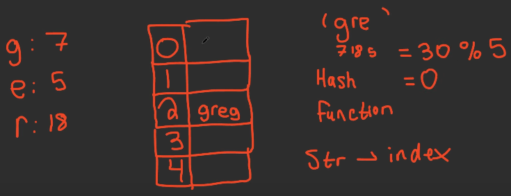

# **Hash Tables**

## **1. Overview**

A hash table is dynamic set that is an effective data structure for implementing dictionaries. A great thing about hash tables is that regadless of how many items are stored on it, you can lookup elements in constant time on average.

### Hash Functions

A **Hash Function** maps data, e.g. strings, to numbers. There are some requirements for a hash function:

* It needs to be consistent.
* It should map words to different numbers.

There are "infinite" number of hash functions but some are better than others. When mapping a string, the easiest hash function is to calculate the sum of all characters and then calculate the remainder (using the modulo operator) with the number of slots in the map.



A collision is when to different strings maps to the same slot in the hash table. So many different strings that are possible for a limited number of slots, collisions are possible. The most used method to solve collisions is **separate chaining**, where each slot is a linked list. Another method is linear probing.

### Sets

Collection of unique items. You can lookup, insert, and delete an element in constant time.

### Maps

Hash maps have the same functionalities than a hash set, except that it can store data.

* **Use Cases:** 
  * DNS Resolution: mapping a web address to an IP address.

---

## **2. Operations and Complexities**

| Operation      | Time Complexity | Notes                                      |
|----------------|-----------------|--------------------------------------------|
| Search (lookup)         | O(1)            | On average, worst case is O(n)             |
| Insert (add)         | O(1)            | On average, worst case is O(n)             |  
| Delete         | O(1)            | On average, worst case is O(n)             |

Altough searching for an element in a hash table can take as long as O(n), in practice, hashing performs extremely well. Under reasonable assumptions, the average time to search for an element in a hash table is O(1).

In the average case, hash tables are as fast as arrays at searching, and they are as fast as linked lists at inserts and deletes. In the worst case, it could be faster at all of those.

---

## **3. Strengths and Weaknesses**

| **Strengths**                | **Weaknesses**                           |
|------------------------------|------------------------------------------|
| Modelling relationships from one thing to another      | Collisions     |
| Filtering out duplicates  |                                             |
| Caching/memorizing data instead of duplicating  work  |                 |

<!-- How can we find things quickly in an unsorted array? with a hash table. -->

<!-- Hash Tables

    Efficient for lookups, insertions, and handling collisions.
    Focus: Hash maps and sets, and understanding how they're implemented (e.g., hash functions). -->

---

## **4. Important Techniques**

* There are multiple ways to deal with collisions. The simple one is this: if multiple keys map to the same slot, start a linked list at that slot. -->

---

## **5. Must-Know Problems**

* **Problem 1:** Brief description of the problem and why it's important.
* **Problem 2:** Another key problem and how it tests your understanding.  
* Organize problems into categories if needed (e.g., traversal, searching, etc.).

<!-- * Minimum Characters for Words - algoexpert -->

---

## **6. Common Mistakes**

* Collisions: Two keys have been assigned the same slot.
* Misunderstanding amortized complexities (e.g., hash table operations).

---

## **7. Cheat Sheet / Key Formulas**

* Key patterns or pseudocode templates.  
* Example: Recursion template for binary tree traversal:

  ```python
  def traverse(node):
      if not node:
          return
      traverse(node.left)
      process(node)
      traverse(node.right)
  ```

## **8. References**

* [Hash Tables: Hash Fucntions, Sets, & Maps](https://www.youtube.com/watch?v=iZyxNEBpqFY&list=PLKYEe2WisBTFEr6laH5bR2J19j7sl5O8R&index=5&ab_channel=GregHogg)
