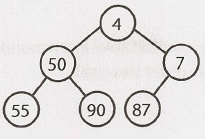

# Heaps

A heap is a tree-based data structure that satisfies the heap property:

"In a max heap, for any given node C, if P is the parent node of C, then the
key (the value) of P is greater than or equal to the key of C. In a min heap, the key of P is less than or equal to the key of C."

The node at the "top" of the heap (with no parents) is called the root node.

The heap is an efficient implementation of an abstract data type called
priority queue.

## Binary Heaps

Min-heaps and max-heaps are binary heaps. Max-heaps and min-heaps are essentially equivalent, but the elements are in descending order for max-heaps, i.e., the max value in the top, and in ascending order for min-heaps, i.e., the min value at the top.

A min-heap is a complete binary tree, i.e., the tree is totally filled other than the rightmost elements on the last level, where each node is smaller than its children. The root, therefore, is the minimum element in the tree.

We have two key operations on a min-heap: `insert` and `extract_min`.

**Insert:**

When we insert into a min-heap, we always start by inserting the element at the bottom. We insert at the rightmost sport so as to maintain the complete tree property.

Then, we rearrange the elements of the tree by swapping the new element with its parent, until we find an appropiate spot for the element. We essentially bubble up the minimum element.

This takes `O log (n)` time, where n is the number of nodes in the heap.

**Extract Minimum Element:**

Finding the minimum element of a min-heap is easy: it's always at the top.

To remove the minimum element and swap it with the last element in the heap (the bottommost, rightmost element), we bubble down the minimum element, swapping it with one of its children until the min-heap property is restored.

We can swap the min element with either its left child or its right child, but we need to swap it with the smaller children to maintain the min-heap ordering.

## Priority Queues

Priority queues are often referred to as "heaps", regardless of how they may
be implemented.

In C++, the standard library provides a priority queue `std::priority_queue`.
