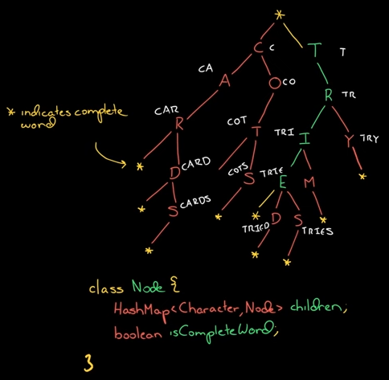

# Tries

## **1. Overview**

Tries are based on trees. Tries are used to solve the problem of representing a set of words. The term "trie" comes from the word re**trie**val. A trie is a tree data structure used to store and retrieve keys in a dataset of strings efficiently. This data structure has various applications, such as autocomplete and spellchecker.

Tries are also called prefix trees.

A trie is a tree-like data structure where the tree's nodes store the entire alphabet, and strings/words can be re**trie**ved by traversing down a branch path of the tree.

Used for validation of words. Another use case is in the autocomplete feature of search engines like Google.

The shape and structure of a trie is always a set of linked nodes, all connecting back to an empty root node. Each node contains an array of pointers (child "nodes"), one for each possible alphabetic value.

The size of a trie correlates to the size of the alphabet it represents. Every node has 26 references to possible child nodes in the English alphabet.

<!-- TODO: https://medium.com/basecs/trying-to-understand-tries-3ec6bede0014 - Replicate the exercise given at "Giving trie traversal a try" with another saying and adding a new word. -->

There are some great benefits to using tries.

For starters, the bulk of the work in creating a trie happens early. When first adding nodes, we must allocate memory for an array each time. As the trie grows in size, we have to do less work each time we add a value since it's likely that the nodes were initialized before with their values and references. Adding intermediate nodes becomes a lot easier.

A trie is used to store the entire (English) language for quick prefix lookups. While a hash table can quickly look up wheter a string is a valid word, it cannot tell us if a string is a prefix of any valid words. A trie can do this very quickly.

* **Use Cases:**
  * Example: Efficient searching and sorting (e.g., database indexing).
  * Example: Suitable for priority-based tasks (e.g., heaps for priority queues).

---

## **2. Operations and Complexities**

| Operation      | Time Complexity | Notes                                      |
|----------------|-----------------|--------------------------------------------|
| Search         | O(a*n)          |  |
| Insert         | O(a*n)          | |
| Delete         | O(a*n)          |                                            |

The worst-case runtime for creating a trie structure is dependent on how many words the trie contains and how long they might potentially be, known as O(m*n) time, where m is the length of the longest word, and n is the total number of words.

The time of searching, inserting, and deleting from a trie depends on the length of the word a and the total number of words, O(a*n) time.

---
