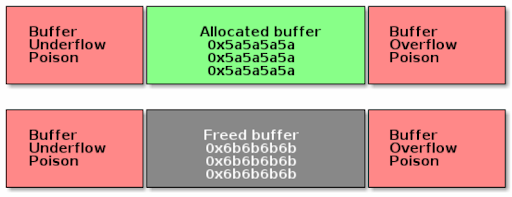

# Debugging

The Linux kernel provides a set of tools and debug options useful for investigating abnormal behavior.

## Decoding an oops / panic

An **oops** is the usual way a kernel communicates to the user that something bad happened, i.e., an inconsistent state that the kernel detects inside itself. Because the kernel is the supervisor of the entire system, it cannot fix itself or kill itself as it can when user-space goes awry. Instead, the kernel issues an oops.

## How would you debug a Linux kernel module or a driver?

Debugging a kernel module typically follows a few complementary approaches, often used together:
- **Logging**: `printk()` with appropriate log levels (`KERN_ERR`, `KERN_DEBUG`, etc.), inspected via `dmesg`
- **Static analysis**: `sparse`, `smatch`, or `coccinelle` to catch bugs before runtime
- **Live debugging**: `crash`, `drgn`, or `kgdb` when a hypervisor or JTAG interface is available
- **Sanitizers**: KASAN, UBSAN, and lockdep to catch memory and locking bugs as they happen
- **Tracing**: ftrace or eBPF to observe control flow and timing without stopping the system
- **Crash analysis**: examining a kernel dump (`vmcore`) with `crash` or `drgn` after a panic
The right tool depends on whether the bug is reproducible live, only shows up under load, or has to be reconstructed after a crash.

## crash, drgn, kgdb

One essential part of Linux kernel development is debugging. In user space we have the support of the kernel, i.e., we can halt processes and use gdb to inspect the program’s state and behavior. In kernel space, to use gdb we need a hypervisor like QEMU or a JTAG-based hardware interface, which is not always available.

## List debugging

The kernel provides `CONFIG_DEBUG_LIST` to catch corruption in its doubly linked lists (`list_head`).
- Validates list pointers on insertion and removal
- Detects common bugs like double-add, double-delete, and use of an uninitialized list
- Adds runtime checks to `list_add()`, `list_del()`, and related helpers, at a small performance cost
- Should be enabled during development/testing, not typically in production kernels

## Memory debugging

Memory bugs:

* Use-before-init bug
* Use-after-free bug
* Buffer overflow bug

There are several tools for memory debugging:

* SLAB/SLUB debugging

Slab debugging uses a memory poison technique to detect several types of memory bugs in the SLAB/SLUB allocators. The allocated buffers are guarded with memory that has been filled with special markers.

* KASAN
* kmemcheck
* DEBUG_PAGEALLOC

## Debugging Locks

Locking bugs are common in the Linux kernel due to concurrency and preemption.  
Typical issues include:

- Deadlocks
- Double locking / double unlock
- Sleeping in atomic context
- Lock order inversion
- Missing locks (race conditions)

The kernel provides several tools to debug locking problems:

### lockdep (Lock Validator)

- Enabled with `CONFIG_LOCKDEP`
- Tracks lock dependencies at runtime
- Detects deadlocks and lock ordering issues
- Prints warnings when incorrect locking patterns are detected

### DEBUG_SPINLOCK / DEBUG_MUTEX

- Enable extra runtime checks for spinlocks and mutexes
- Detect double unlocks, bad initialization, and misuse

### PROVE_LOCKING

- Performs advanced lock dependency validation
- Often enabled together with lockdep

### Useful Techniques

- Use `might_sleep()` to detect sleeping in atomic context
- Use `lockdep_assert_held()` to verify expected lock ownership
- Inspect stack traces in kernel warnings
- Reduce the problem using minimal repro cases

Locking debugging is essential when working with interrupts, bottom halves, SMP systems, and preemptible kernels.

## Profiling

Profiling helps identify where the kernel or a driver spends time and resources, as opposed to debugging, which focuses on correctness.

### perf

- The standard Linux profiling tool, built on the `perf_events` subsystem
- Can sample CPU cycles, cache misses, branch mispredictions, and other hardware counters
- Supports both system-wide and per-process profiling
- `perf record` / `perf report` for sampling-based profiling
- `perf stat` for aggregate counter statistics
- `perf top` for a live view, similar to `top` but for hot functions

### ftrace
- Built-in kernel tracer, accessed via `/sys/kernel/debug/tracing`
- Useful for function-level tracing, latency analysis, and scheduling behavior
- Tracers include `function`, `function_graph`, and `irqsoff`/`preemptoff` for latency debugging

### Tracepoints and eBPF
- Static tracepoints are predefined instrumentation points in kernel code
- eBPF (via `bpftrace` or `bcc` tools) allows writing custom, low-overhead profiling programs that attach to tracepoints, kprobes, or uprobes
- Well suited for dynamic, targeted profiling without recompiling the kernel

### Flame graphs
- A visualization built from stack samples (commonly from `perf record`)
- Makes it easy to spot which call paths consume the most CPU time at a glance

### /proc-based tools
- `/proc/stat`, `/proc/interrupts`, and `/proc/<pid>/stack` provide lightweight, low-overhead snapshots without dedicated tooling
- Useful for quick checks when `perf` or `ftrace` aren't available
