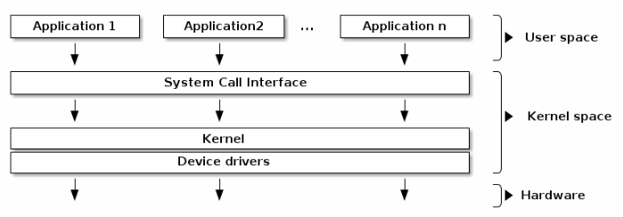

# Linux Kernel

Linux is an OS (comercial) and just the kernel (technical).

## What is the Linux kernel, and what is its purpose?

In typical OS architecture, the kernel is responsible for accessing and sharing the hardware securely and fairly with multiple applications.

In practice, the operating system's role is to provide programs with a consistent view of the computer's hardware. In addition, the operating system must account for the independent operation of programs and protection against unauthorized access to resources. This nontrivial task is possible only if the CPU enforces protection of the system software from the applications.

The kernel is a large, standalone program with detailed and explicit requirements on how its pieces are put together.

Every software package used in a Linux system has its release number, and there are often interdependencies across them.

Linux system consists of kernel, C library, toolchain, basic system utilities (e.g.,
init and bash). In Linux, there is a strong separation between user space and kernel
space. The Linux kernel has a monolithic design, unlike QNX that has a microkernel
design.

## Main components of the Linux kernel?

The core kernel is divided into multiple logic subsystems:

* File access
* Networking
* Process management
* Scheduling

## Introduction to the Linux kernel

We are standing on the shoulders of giants. Even Linus Torvalds used Dennis Ritchie
and Ken Thompson's Unix to build the Linux kernel.

In Unix "everything" is a file. Unix is written in C. Strong separation between
policy (what needs to be done) and mechanism (how it is done). Simple and elegant
design.

Linux kernel development has a special set of characteristics:

* Git is used to obtain the sources and for version control
* Multiple ISAs are supported. There is a clean separation of arch specific and arch independent code
* The `make` tool is used for building
* No standard C library (some functions implemented inside the kernel)
* No floating-point operations
* The kernel has a small per-process fixed-size stack
* Susceptible to race conditions. Solution: spinlocks and semaphores.
