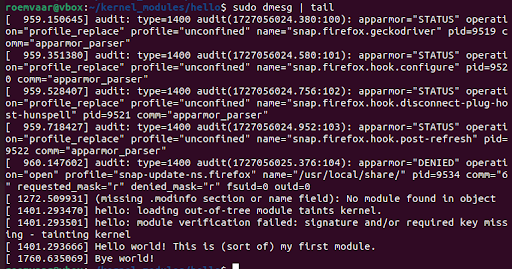

# Modules (Loadable Kernel Object)

Every kernel module registers itself to serve future requests, and its initialization function terminates immediately. The module's exit function gets invoked just before the module is unloaded.

A module is linked only to the kernel, and the only functions it can call are the ones exported by the kernel; there are no libraries to link to. Only functions that are part of the kernel itself may be used in kernel modules. Anything related to the kernel is declared in the kernel source tree headers. Most relevant headers live in `include/linux`, but other subdirectories of the `include` directory has been added to host material associated with specific kernel subsystems.

The role of a module is to extend kernel functionality; modularized code runs in **kernel space**. Usually, in a driver, some functions are executed as part of system calls, and some are in charge of interrupt handling.

A kernel fault kills the current process, at least, if not the whole system.

The Linux way of looking at devices distinguishes between three fundamental device types:

* **char module**
* **block module**
* **network module**

Despite being "monolithic" in that the whole kernel runs in a single address space, the Linux kernel is modular, supporting the dynamic insertion and removal of code from itself at runtime.

Related subroutines, data, and entry and exit points are grouped in a single binary image, a loadable kernel object called a **module**.

Support for modules allows systems to have only a minimal base kernel image, with optional features and drivers supplied via loadable, separate objects. Modules also enable the removal and reloading of kernel code, facilitate debugging, and allow for the loading of new drivers on demand in response to the hot plugging of new devices.

## Write a hello world (basic) kernel module in Linux

```c
/*
* hello.c - The Hello, World! Kernel Module
*/


#include <linux/init.h>
#include <linux/module.h>
#include <linux/kernel.h>


/*
* hello_init - the init function, called when the module is loaded.
* Returns zero if successfully loaded, nonzero otherwise.
*/
static int hello_init(void)
{
   printk(KERN_ALERT "I bear a charmed life.\n");
   return 0;
}


/*
* hello_exit - the exit function, called when the module is removed.
*/
static void hello_exit(void)
{
   printk(KERN_ALERT "Out, out, brief candle!\n");
}


module_init(hello_init);
module_exit(hello_exit);


MODULE_LICENSE("GPL");
MODULE_AUTHOR("Shakespeare");
MODULE_DESCRIPTION("A Hello, World Module");
```

Code 1. Linux Kernel Module - Hello World (hello.c)

## insmod vs modprobe, lsmod, rmmod

modprobe is the intelligent version of insmod. insmod simply adds a module where modprobe looks for any dependency (if that particular module is dependent on any other module) and loads them.

## How to unload a built-in kernel driver?

You can't, you need to rebuild the driver as a module.

## Steps to build and insert a module in Linux

1. Install toolchain (build-essential) and Linux headers specific to the target Linux kernel

2. Create the source file (hello.c)

3. Create the Makefile


Makefile to compile an out-of-tree kernel module.

4. Build using `make`

5. Insert module to the host kernel using `sudo insmod hello.ko`

6. Check module logs using `dmesg | tail`



7. Remove the module `sudo rmmod hello`
