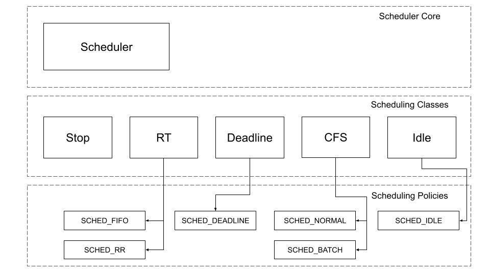
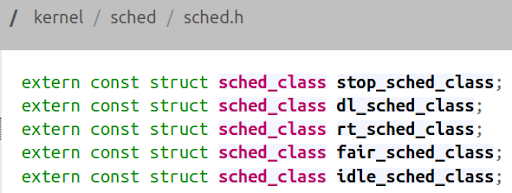

# Scheduler

Running processes is the main point of using a computer. The Linux kernel CFS
process scheduler comes close to providing an optimal solution for most use cases
with good scalability.

In Figure 1, the relationship between the scheduler core, scheduling classes, and scheduling policies is presented.

Figure 1. Relationship of Scheduler Core, Classes, and Policies

## Scheduler Classes

The Linux scheduler is modular, enabling different algorithms to schedule different types of processes. This modularity is called **scheduler classes**. Scheduler classes enable
different, pluggable algorithms to coexist, scheduling their own types of processes. Each scheduler class has a priority. The core kernel CPU scheduler code, defined in [kernel/sched/core.c](https://elixir.bootlin.com/linux/v6.11.5/source/kernel/sched/core.c), iterates over each scheduler class in order of priority. The highest priority scheduler class that has a
runnable process wins, selecting who runs next.

The Linux scheduler is modular, enabling different algorithms to schedule different processes. This modularity is called **scheduler classes**. Scheduler classes enable different, pluggable algorithms to coexist, scheduling their types of processes. Each scheduler class has a priority. The core kernel CPU scheduler code, defined in [kernel/sched/core.c](https://elixir.bootlin.com/linux/v6.11.5/source/kernel/sched/core.c), iterates over each scheduler class in order of priority. The highest priority scheduler class with a runnable process wins, selecting who runs next.

struct rq - main, per-CPU run queue data structure. In a computer, multiple processes run at once. Active processes are placed in an array called a run que, or runqueue.

* struct cfs_rq
* struct rt_rq
* struct dl_rq

Figure 2. Scheduler Classes

There are five scheduling classes, from higher to lower priority: Stop Class, Real-Time Class, Deadline Class, Completely Fair Scheduler (CFS) Class, and Idle Class.

## Completely Fair Scheduler (CFS)

Default scheduler in Linux, designed to fairly distribute CPU time among tasks. [CFS’s](https://docs.kernel.org/scheduler/sched-design-CFS.html) design can be summed up in: CFS models an “ideal, precise multitasking CPU” on real hardware.

* An “ideal multitasking CPU” is a non-existent CPU that has 100% physical power and which can run each task at precise equal speed, in parallel, each at 1/nr_running speed.
    * Example: if there are two tasks running, then it runs each at 50% physical power, i.e.,  actually in parallel.

The traditional Unix algorithm has problems regarding the timeslices. Assigning absolute timeslices yields a constant switching rate but variable fairness. This is solved by using CFS. The approach taken by CFS is radical (for process schedulers) rethinking of time slice allotment. Do away with timeslaces completely and assign each process a proportion of the processor. CFS thus yields constant fairness but a variable switching rate.

Linux’s CFS scheduler does not directly assign timeslices to processes. Instead, in a novel approach, CFS assigns processes a proportion of the processor. On Linux, the amount of processor time that process receives is a function of the load of the system. This assigned proportion is further affected by each process’s nice value. 

### CFS is based on a simple concept

Model process scheduling as if the system had an ideal multitasking processor. In such a system, each process would receive 1/n of the processor’s time, where n is the number of runnable processes, and we’d schedule them for infinitely small durations so that in any measurable period, we’d have run all n processes for the same amount.

Although we’d like to run processes for very small durations, CFS is mindful of the overhead and performance hit. Instead, CFS will run each process for some time, round-robin, selecting next the process that has run the least. Rather than assign each process a timeslice, CFS calculates how long a process should run as a function of the total number of runnable processes. Instead of using the nice value to calculate a timeslice, CFS uses the nice value to **weight** the proportion of processor a process is to receive: Higher valued (lower priority) processes receive a fractional weight relative to the default nice value, whereas lower valued (higher priority) processes receive a larger weight.

CFS imposes a floor on the timeslice assigned to each process **called minimum granularity**. By default, it is 1 millisecond.
